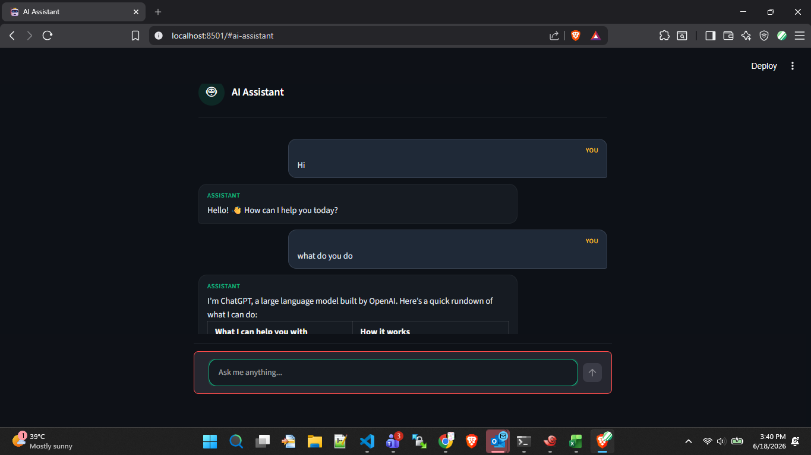

# 🤖 AI Assistant

A conversational AI chatbot built with **Streamlit**, **LangGraph**, and **Groq** — with real-time web search capability via Google Serper API.

---

## Features

- 💬 Multi-turn conversation with memory (persists within session)
- 🔍 Real-time web search using Google Serper
- ⚡ Fast inference powered by Groq
- 🎨 Clean dark UI with custom CSS

---

## Tech Stack

| Layer | Tool |
|---|---|
| UI | Streamlit |
| LLM | Groq (`openai/gpt-oss-20b`) |
| Agent Framework | LangGraph (`create_react_agent`) |
| Memory | LangGraph `MemorySaver` |
| Web Search | Google Serper API |
| Config | python-dotenv |

---

## Project Structure

```
├── app.py          # Main application
├── style.css       # UI styling
├── .env            # API keys (not committed)
├── requirements.txt
└── README.md
```

---

## Getting Started

### 1. Clone the repo

```bash
git clone https://github.com/Vivek-Singh98/ai-assistant.git
cd ai-assistant
```

### 2. Install dependencies

```bash
pip install -r requirements.txt
```

### 3. Set up environment variables

Create a `.env` file in the root directory:

```env
GROQ_API_KEY=your_groq_api_key
SERPER_API_KEY=your_serper_api_key
```

- Get Groq API key → [console.groq.com](https://console.groq.com)
- Get Serper API key → [serper.dev](https://serper.dev)

### 4. Run the app

```bash
streamlit run app.py
```

---

## Requirements

```
streamlit
langchain
langchain-groq
langchain-community
langgraph
python-dotenv
```

> Save this as `requirements.txt` or run `pip freeze > requirements.txt`

---

## How It Works

1. User sends a message via the chat input
2. The message is passed to a **LangGraph ReAct agent**
3. Agent decides whether to answer directly or **search the web** first
4. Response is stored in **session memory** so the agent remembers context
5. Full conversation history is displayed in the UI

---



---

## Author

Vivek Singh   
[LinkedIn](https://www.linkedin.com/in/vivek-singh-256669251/) · [GitHub](https://github.com/Vivek-Singh98)